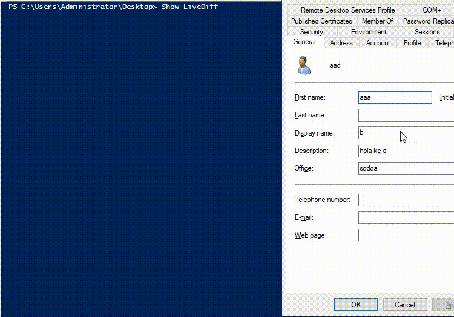

# LiveDiffAD

LiveDiffAD is a tiny powershell script used to grab Active Directory changes on the fly.



## How it works

The script:

1. is based on [UncoverDCShadow](https://github.com/AlsidOfficial/UncoverDCShadow), which uses the [LDAP_SERVER_NOTIFICATION_OID (1.2.840.113556.1.4.528)](https://msdn.microsoft.com/en-us/library/cc223320.aspx) LDAP control. This special control can be used to retrieves the object which are being changed ;
2. grab replication metadata for the targeted object, and compare it to the `LocalUSN`. If the USN is higher, indicating a more recent change, the new value is printed and the internal USN updated accordingly
3. uses `repadmin /showchanges` cookies (placed on script start-up in `cookie*.bin` files) to print a summary of all the changes made during `Show-LiveDiff` call, and avoid missing one of them. Indeed, this method, while using the same concepts, does not reuse the information grabbed by the script. Therefore, one can have a stronger confidence in its global diff results.

## Usage

```powershell
# Import the script
PS> Import-Module .\livediff.ps1
# Launch the live view
PS> Show-LiveDiff
...
```

For each change, the script will highlight the target object, and its attributes being changed.

Once the script is terminated, a change summary is printed.

```powershell
# Summary for the domain naming context
[Summary - DC=WINDOMAIN,DC=LOCAL]
Using cookie from file cookie.bin (132 bytes)

==== SOURCE DSA: DC.WINDOMAIN.LOCAL ====
...

# Summary for the Configuration naming context
[Summary - CN=Configuration,DC=WINDOMAIN,DC=LOCAL]
...

# Summary for the Schema naming context
[Summary - CN=Schema,CN=Configuration,DC=WINDOMAIN,DC=LOCAL]
...

# Summary for the Forest DNS Zones naming context
[Summary - DC=ForestDnsZones,DC=WINDOMAIN,DC=LOCAL]
...

# Summary for the Domain DNS Zones naming context
[Summary - DC=DomainDnsZones,DC=WINDOMAIN,DC=LOCAL]
...
```

The files `cookies*.bin` are updated at the end of the script, and can be used as a checkpoint after the script termination.

## Examples

The [diff_examples](./diff_examples) directory highlights changes made during some scenarios.
